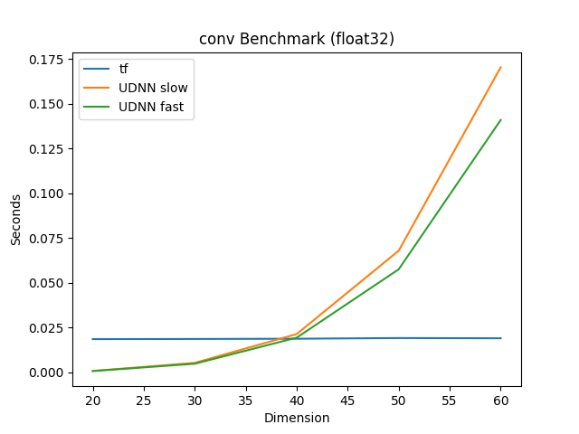
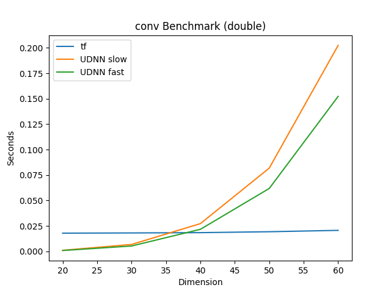
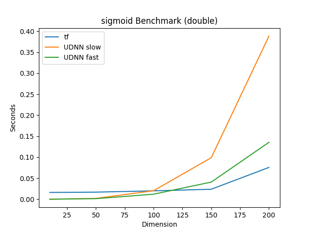
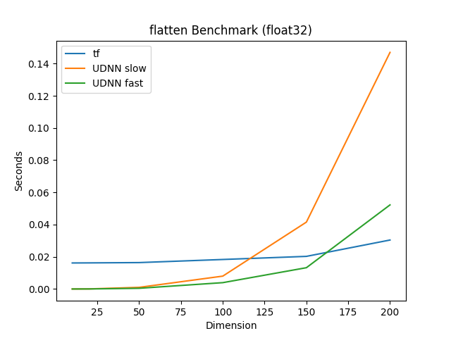
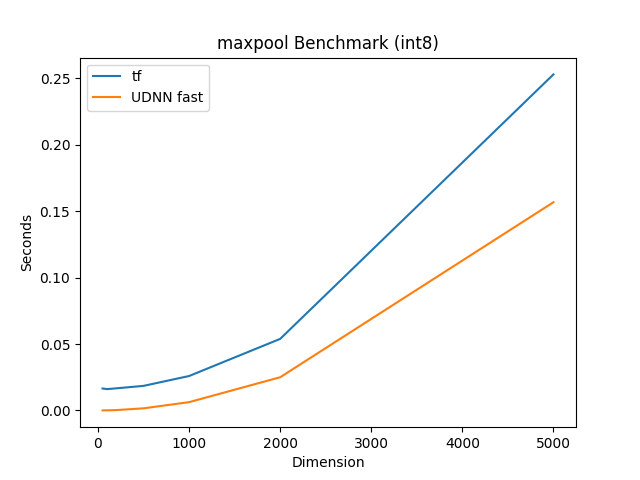
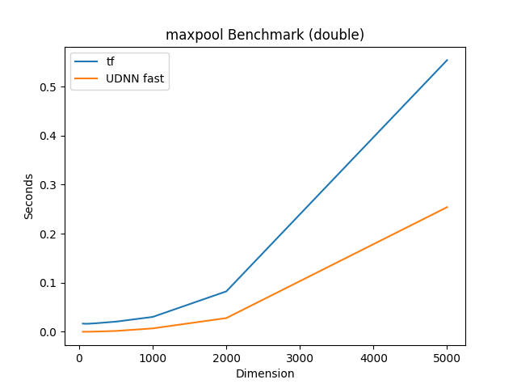

## Model Benchmarks

### Intel CPU

The Tensorflow model is able to run inference on 1000
samples in 594 ms, with 75.2% accuracy.

The UDNN model runs inference on 1000 samples
in 32.5 seconds, with 75.2% accuracy.

Conclusion: UDNN is much slower (especially Conv2D operation),
but achieves identical accuracy.

## ARM CPU

## Operation Benchmarks

For completeness, we provide timing benchmarks for each
of the implemented operations, including UDNN implementations
with SIMD acceleration (fast), and without (slow). We benchmark
against Tensorflow 2.0, on an Intel CPU, using varing dimensional
inputs.

